# DDSY

This is a demo project for DDD infrastructure with Symfony 7. This is a proof of concept and a learning point. Nothing serious is to be expected.

## Implementation chart

In the following chart, I explain how different pieces of code can interact together.

## Communication Flow chart

The next chart explains the flow of calls and instantiations. This would give you a broader overview on the interactions between the different parts of the app.

## Contribution

Feel free to contribute if you think you can build on this.

Code style: Commit your own code style, no worries :) 

## Notes

- Needed to work on the typing of the columns to rely less on the doctrine package configuration
- More tests are welcome!
- More UseCases (Commands/Queries) are also welcome as a proof of concept